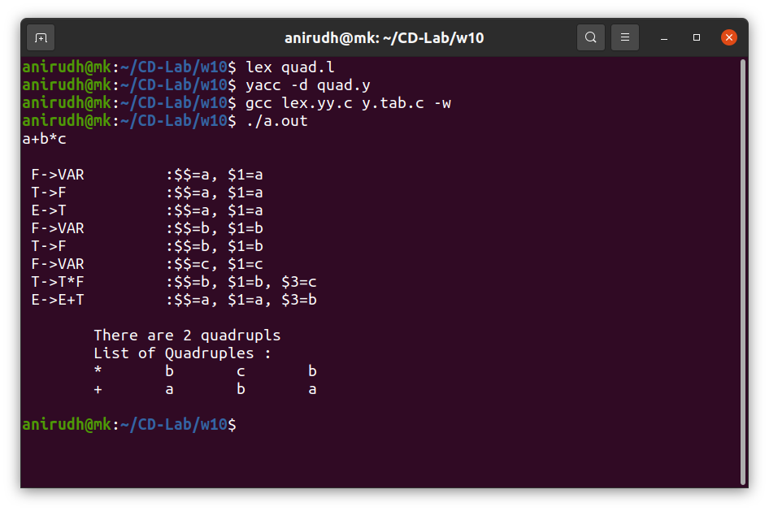
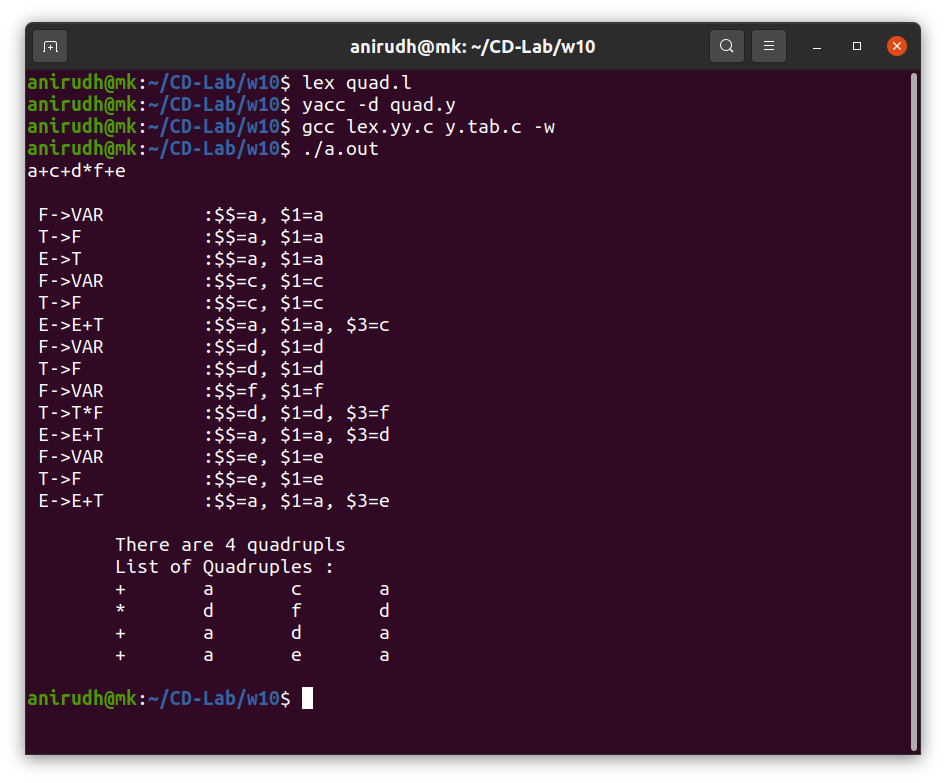
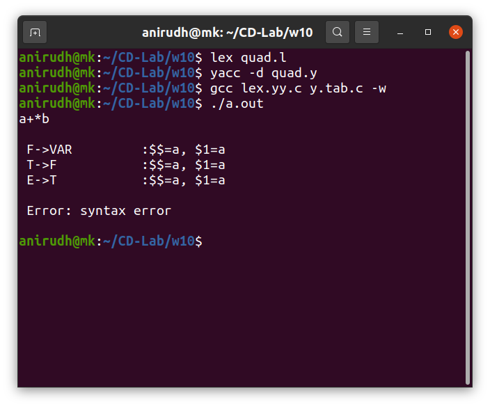

## Week 10 : Generation of quadruples for given arithmetic expression

#### 1. Generating quadraple for expression generated by CFG

E → E+T | T     \
E’→ T*F | F     \
F → (E) | d     

 

#### Output

##### Testcase 1

--------------------------------------

 

##### Testcase 2

--------------------------------------

 

##### Testcase 3

