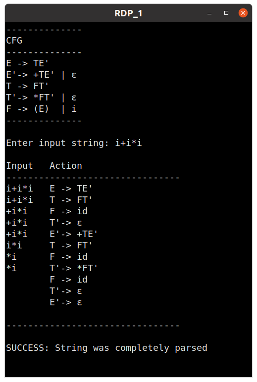
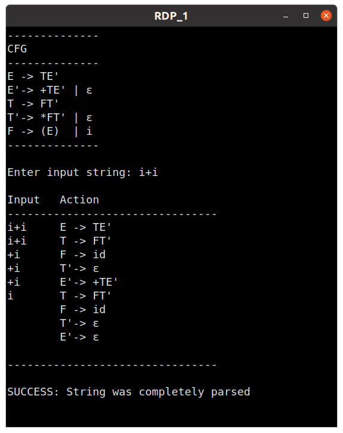
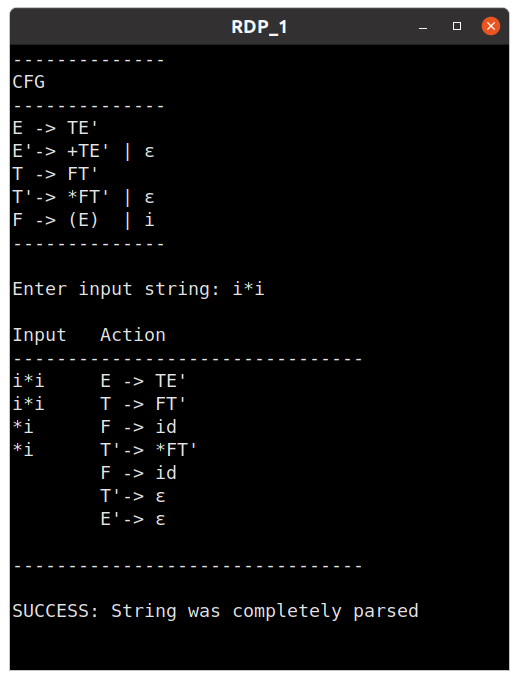
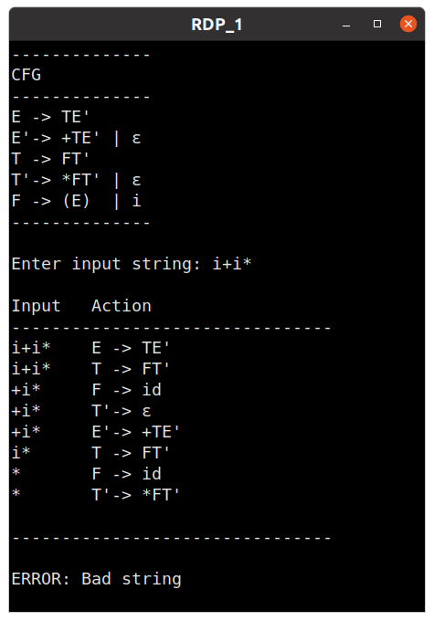
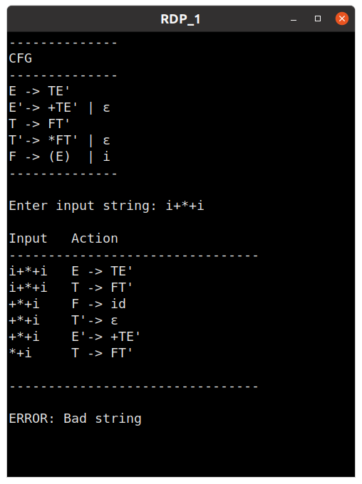
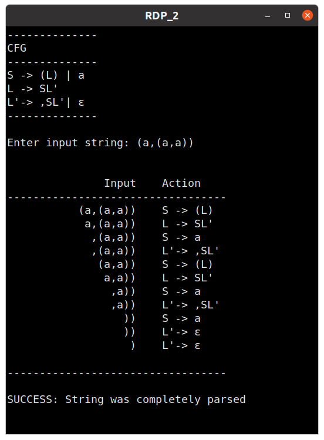
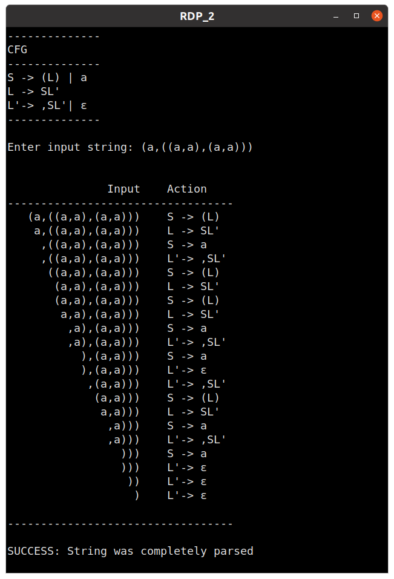

## Week 6 :  Implementation of Recursive Descent Parser

#### 1. Implementing Recursive Descent Parser for the Expression Grammar given below:

E → TE’         \
E’→ +TE’ | ε    \
T → FT’         \
T’→ *FT’ | ε    \
F → (E)  | i    

 

##### Testcase 1

##### Testcase 2

##### Testcase 3

##### Testcase 4

##### Testcase 5

--------------------------------------

 

#### 2. Constructing Recursive Descent Parser for the Grammar given below:

S → (L) | a     \
L → L,S | S

##### CFG With Left Recursions removed:

S → (L) | a     \
L → SL'         \
L'→ ,SL' | ε

 

##### Testcase 1

##### Testcase 2

