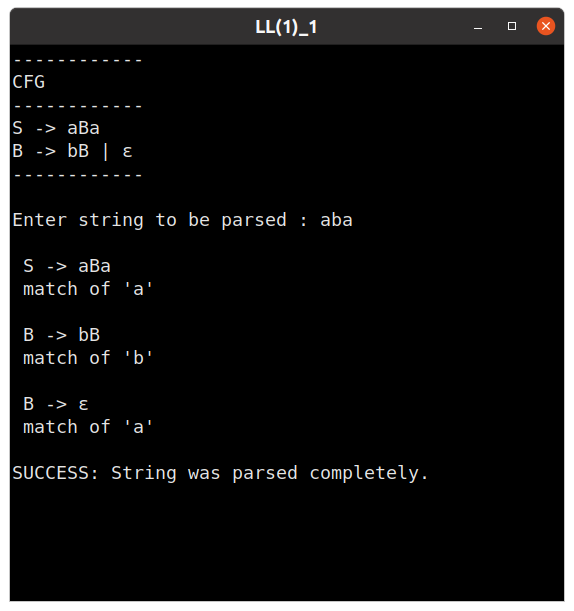
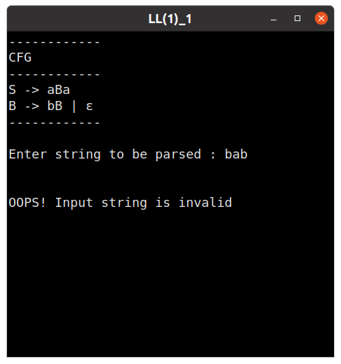
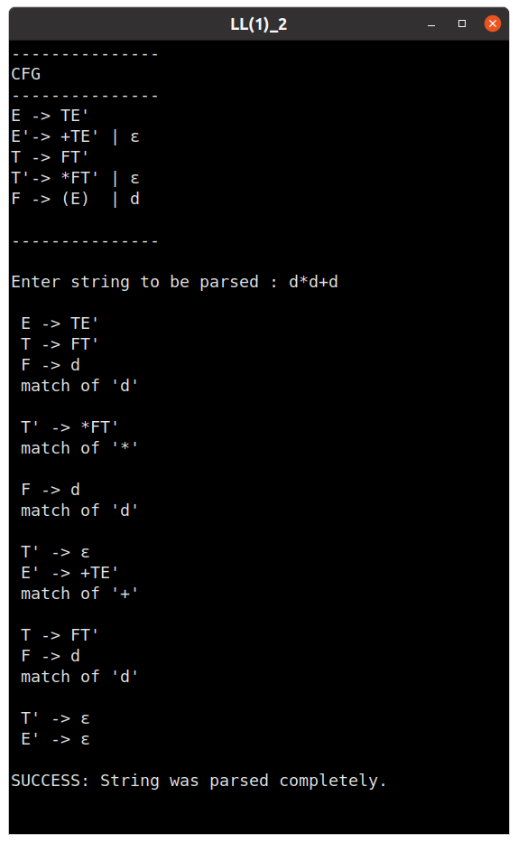
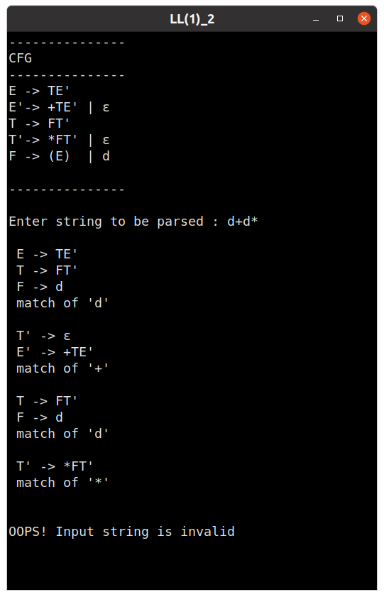

## Week 7 : Implementation of LL(1) Parser

#### 1. Implementing Non-recursive Predictive Parser for the grammar:

S -> aBa        \
B -> bB | ε

 

##### Testcase 1

##### Testcase 2

--------------------------------------

 

#### 2. Implementing Non-recursive Predictive Parser for the Expression Grammar:

E → TE’         \
E’→ +TE’ | ε    \
T → FT’         \
T’→ *FT’ | ε    \
F → (E)  | d

 

##### Testcase 1

##### Testcase 2

