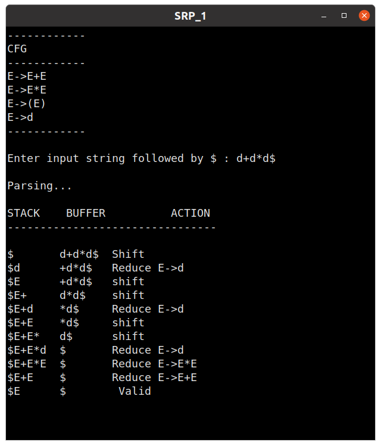
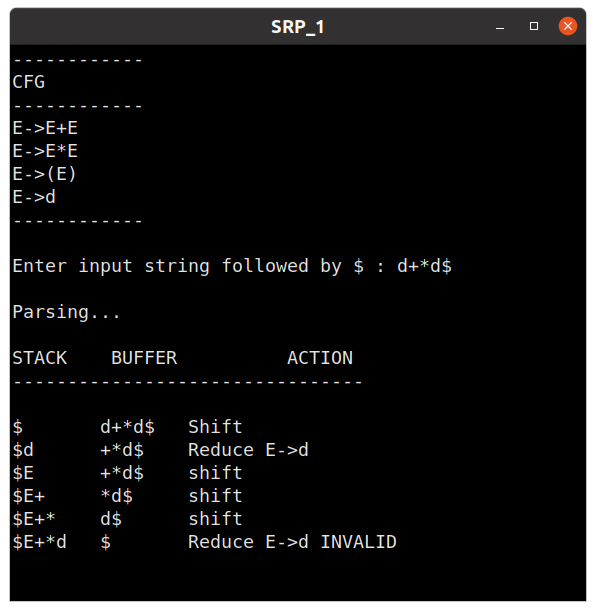
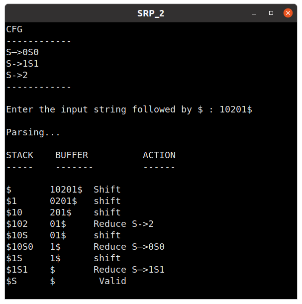
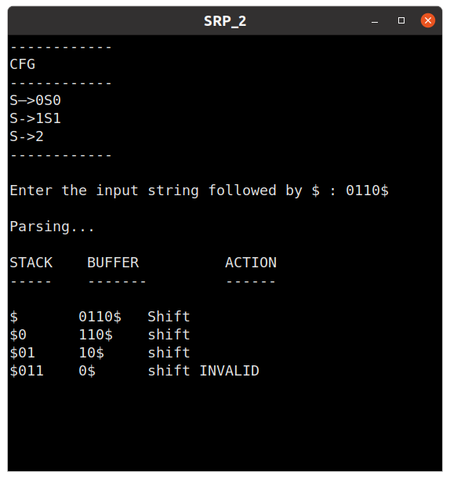

## Week 8 : Implementation of Shift Reduce Parser

#### 1. Implementing Shift Reduce Parser for the following grammar:

E → E+E   \
E → E*E   \
E → (E)   \
E → d

 

##### Testcase 1

##### Testcase 2

--------------------------------------

 

#### 2. Implementing Shift Reduce Parser for the following grammar:

S –> 0S0 | 1S1 | 2

 

##### Testcase 1

##### Testcase 2

