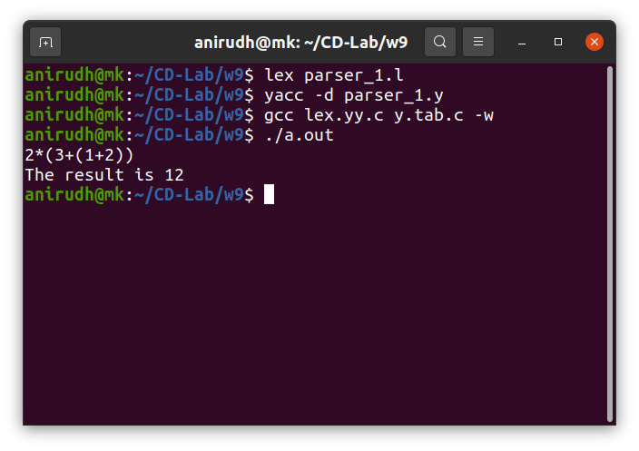

## Week 9 : Implementation of LALR parser using LEX and YACC

#### 1. Implementing LALR Parser for the following grammar:

E → E+T | T     \
E’→ T*F | F     \
F → (E) | d     

 

##### Output

--------------------------------------

 

#### 2. Implementing LALR Parser for the following grammar:

E → E+E | E-E | E*E | E/E | -E | (E) | digit

 

##### Output

